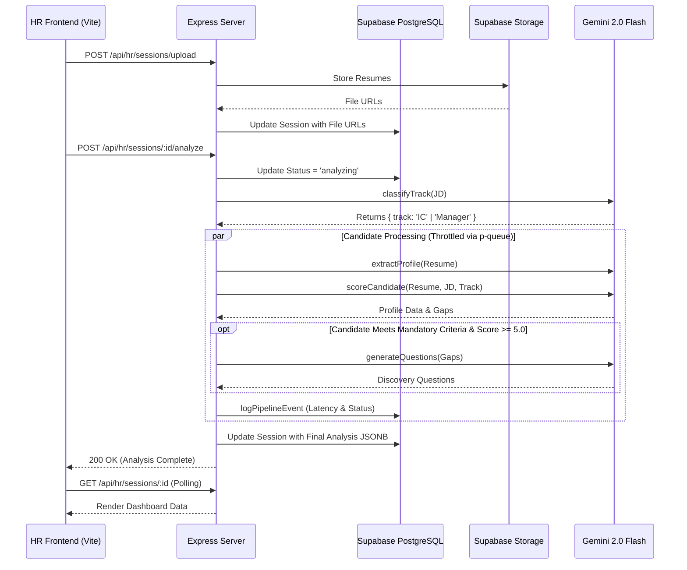

# Talent Tailor HR Screening Workflow

This document outlines the step-by-step user journey and system interactions during a resume screening session.

## High-Level Process Flow

```mermaid
flowchart TD
    A[HR User Logs In] --> B[Creates New Screening Session]
    B --> C[Configures Job Profile & Hiring Preferences]
    C --> D[Uploads Candidate Resumes (PDF)]
    D --> E[Triggers AI Analysis Pipeline]
    
    E --> F{AI Pipeline Execution}
    F --> G[Extract Baseline Profiles]
    F --> H[Score Candidates]
    F --> I[Generate Interview Questions]
    
    G --> J[Database Checkpoint]
    H --> J
    I --> J
    
    J --> K[HR Reviews Candidate Dashboard]
    K --> L[Selects Top Candidates]
    L --> M[Proceeds to Interview Stage]
```

## AI Pipeline Orchestration (Sequence Diagram)



## AI Agent Interfaces (I/O Definitions)

The pipeline relies on a mixture-of-experts architecture. Below are the precise inputs and outputs for each AI block:

### 1. Track Classifier (`classifyTrack`)
- **Execution:** Runs once per bulk analysis session.
- **Inputs:** 
  - `Job Description (JD)` (String | Buffer)
- **Outputs:** 
  - `track` (Enum: `'IC'` or `'Manager'`) - Used to calibrate downstream scoring rubrics.

### 2. Baseline Extraction (`extractProfile`)
- **Execution:** Runs in parallel per candidate.
- **Inputs:**
  - `Resume` (String | Buffer)
- **Outputs:**
  - **JSON Profile:** `name`, `email`, `phone`, `currentLocation`, `totalWorkExperience`, `noticePeriod`, `currentCTC`, `expectedCTC`.
  - **Arrays:** `strengths`, `weaknesses`, `education` (Degree, GPA, College), `workHistory` (Company, Designation, Duration, Description).

### 3. Core Scorer (`scoreCandidate`)
- **Execution:** Runs in parallel per candidate.
- **Inputs:**
  - `Resume` (String | Buffer)
  - `Job Description (JD)` (String | Buffer)
  - `Track` (from Track Classifier)
  - `RoleType`, `ExperienceTier`, `HiringPreferences`, `TargetMarket`
- **Outputs:**
  - **Metrics:** `score` (0.0 - 10.0), `atsScore` (0-10), `meetsMandatoryCriteria` (Boolean).
  - **Analysis:** `overallFeedback`, `professionalSummary`, `strengths`, `weaknesses`, `gaps`, `failedCriteria`.
  - **Competencies Array:** Object containing `{ name, score, evidence }`. `evidence` is a strict, grounded quote extracted from the resume.

### 4. Gap Interrogator (`generateQuestions`)
- **Execution:** Runs sequentially *after* Core Scorer, and **only** if the candidate meets mandatory criteria and achieves a minimum score threshold (>= 5.0).
- **Inputs:**
  - `Gaps` (Array of Strings outputted by Core Scorer)
  - `RoleType`, `ExperienceTier`
- **Outputs:**
  - **Questions Array:** 6-8 dynamically generated discovery questions directly targeting the candidate's specific weaknesses for HR interview prep.
