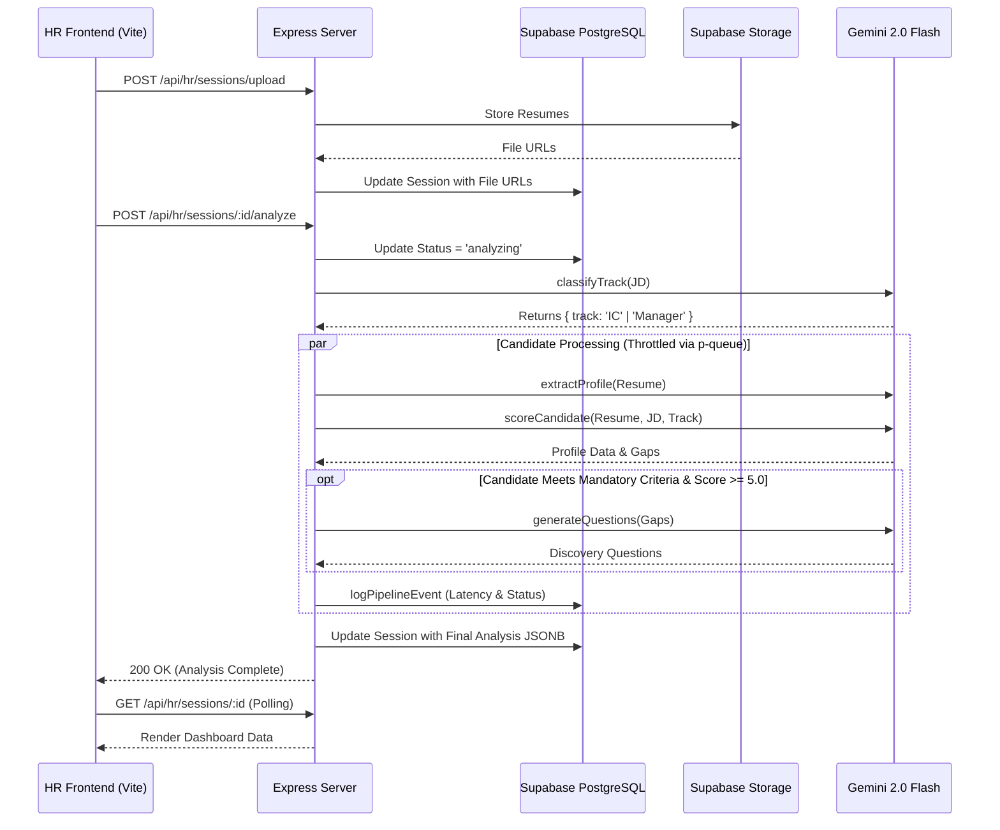

# Talent Tailor HR Screening Workflow

This document outlines the step-by-step user journey and system interactions during a resume screening session.

## High-Level Process Flow

```mermaid
flowchart TD
    A[HR User Logs In] --> B[Creates New Screening Session]
    B --> C[Configures Job Profile & Hiring Preferences]
    C --> D[Uploads Candidate Resumes (PDF)]
    D --> E[Triggers AI Analysis Pipeline]
    
    E --> F{AI Pipeline Execution}
    F --> G[Extract Baseline Profiles]
    F --> H[Score Candidates]
    F --> I[Generate Interview Questions]
    
    G --> J[Database Checkpoint]
    H --> J
    I --> J
    
    J --> K[HR Reviews Candidate Dashboard]
    K --> L[Selects Top Candidates]
    L --> M[Proceeds to Interview Stage]
```

## AI Pipeline Orchestration (Sequence Diagram)


